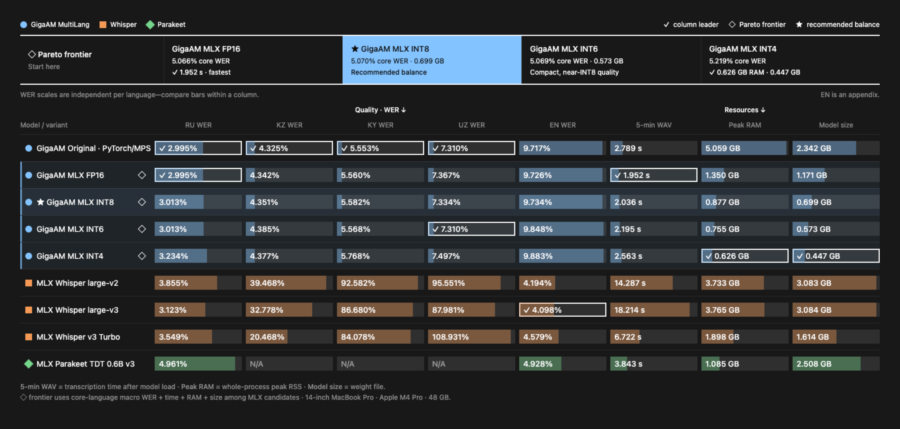

# GigaAM Multilingual MLX vs MLX Whisper and Parakeet

Public benchmark. Lower is better for WER, time, memory, and size.

## Headline quality

| Language | GigaAM MLX INT8 g64 WER (95% CI) | MLX Parakeet TDT 0.6B v3 WER (95% CI) | MLX Whisper large-v2 WER (95% CI) | MLX Whisper large-v3 WER (95% CI) | MLX Whisper large-v3-turbo WER (95% CI) |
|---|---:|---:|---:|---:|---:|
| Russian | 3.013% (2.616–3.430%) | 4.961% (4.492–5.454%) | 3.855% (3.390–4.329%) | 3.123% (2.719–3.533%) | 3.549% (3.104–4.023%) |
| Kazakh | 4.351% (3.861–4.846%) | N/A | 39.468% (38.259–40.704%) | 32.778% (31.694–33.926%) | 20.468% (19.468–21.482%) |
| Kyrgyz | 5.582% (5.061–6.118%) | N/A | 92.582% (91.303–93.996%) | 86.680% (85.703–87.676%) | 84.078% (83.063–85.235%) |
| Uzbek | 7.334% (6.712–7.982%) | N/A | 95.551% (91.824–100.276%) | 87.981% (85.857–90.551%) | 108.931% (104.282–114.052%) |

## English appendix

| Implementation | WER | CER |
|---|---:|---:|
| GigaAM MLX INT8 g64 | 9.734% | 3.005% |
| MLX Parakeet TDT 0.6B v3 | 4.928% | 2.120% |
| MLX Whisper large-v2 | 4.194% | 1.754% |
| MLX Whisper large-v3 | 4.098% | 1.742% |
| MLX Whisper large-v3-turbo | 4.579% | 1.941% |

## Model selection matrix

`✓` column leader · `◇` Pareto frontier · `★` recommended default. Lower is better.
English is an appendix. `5-min WAV` is the Russian five-minute warm median after
model load; Peak RAM is whole-process peak RSS; model size is the weight file.

### ◇ Pareto frontier — focus models

The frontier uses equal-weight macro WER over Russian, Kazakh, Kyrgyz, and Uzbek
plus 5-min WAV time, Peak RAM, and model size among MLX candidates. Original is a
reference baseline; English is excluded as an appendix; models missing a core
language are ineligible.

| Pareto MLX variant | Core macro WER | 5-min WAV | Peak RAM | Model size | Best fit |
|---|---:|---:|---:|---:|---|
| ◇ GigaAM MLX FP16 | 5.066% | **✓ 1.952s** | 1.350 GB | 1.171 GB | fastest; reference-port fidelity |
| **◇ ★ GigaAM MLX INT8 g64** | **5.070%** | **2.036s** | **0.877 GB** | **0.699 GB** | **recommended quality / speed / footprint balance** |
| ◇ GigaAM MLX INT6 g64 | 5.069% | 2.195s | 0.755 GB | 0.573 GB | smaller footprint with near-INT8 quality |
| ◇ GigaAM MLX INT4 g64 | 5.219% | 2.563s | **✓ 0.626 GB** | **✓ 0.447 GB** | minimum model size and peak RAM |

### All compared models

| Model / variant | RU WER | KZ WER | KY WER | UZ WER | EN WER | 5-min WAV | Peak RAM | Model size |
|---|---:|---:|---:|---:|---:|---:|---:|---:|
| Original GigaAM PyTorch/MPS | **✓ 2.995%** | **✓ 4.325%** | **✓ 5.553%** | **✓ 7.310%** | 9.717% | 2.789s | 5.059 GB | 2.342 GB |
| ◇ GigaAM MLX FP16 | **✓ 2.995%** | 4.342% | 5.560% | 7.367% | 9.726% | **✓ 1.952s** | 1.350 GB | 1.171 GB |
| ◇ ★ GigaAM MLX INT8 g64 | 3.013% | 4.351% | 5.582% | 7.334% | 9.734% | 2.036s | 0.877 GB | 0.699 GB |
| ◇ GigaAM MLX INT6 g64 | 3.013% | 4.385% | 5.568% | **✓ 7.310%** | 9.848% | 2.195s | 0.755 GB | 0.573 GB |
| ◇ GigaAM MLX INT4 g64 | 3.234% | 4.377% | 5.768% | 7.497% | 9.883% | 2.563s | **✓ 0.626 GB** | **✓ 0.447 GB** |
| MLX Whisper large-v2 | 3.855% | 39.468% | 92.582% | 95.551% | 4.194% | 14.287s | 3.733 GB | 3.083 GB |
| MLX Whisper large-v3 | 3.123% | 32.778% | 86.680% | 87.981% | **✓ 4.098%** | 18.214s | 3.765 GB | 3.084 GB |
| MLX Whisper large-v3-turbo | 3.549% | 20.468% | 84.078% | 108.931% | 4.579% | 6.722s | 1.898 GB | 1.614 GB |
| MLX Parakeet TDT 0.6B v3 | 4.961% | N/A | N/A | N/A | 4.928% | 3.843s | 1.085 GB | 2.508 GB |

## Full quality matrix

| Language | Implementation | WER | CER | Empty | Exact matches |
|---|---|---:|---:|---:|---:|
| Russian | Original GigaAM PyTorch/MPS | 2.995% | 0.800% | 0 | 410 |
| Russian | GigaAM MLX FP16 | 2.995% | 0.799% | 0 | 410 |
| Russian | GigaAM MLX INT8 g64 | 3.013% | 0.803% | 0 | 409 |
| Russian | GigaAM MLX INT6 g64 | 3.013% | 0.802% | 0 | 410 |
| Russian | GigaAM MLX INT4 g64 | 3.234% | 0.833% | 0 | 396 |
| Russian | MLX Whisper large-v2 | 3.855% | 0.995% | 0 | 370 |
| Russian | MLX Whisper large-v3 | 3.123% | 0.816% | 0 | 404 |
| Russian | MLX Whisper large-v3-turbo | 3.549% | 0.884% | 0 | 385 |
| Russian | MLX Parakeet TDT 0.6B v3 | 4.961% | 1.299% | 0 | 299 |
| Kazakh | Original GigaAM PyTorch/MPS | 4.325% | 1.183% | 0 | 410 |
| Kazakh | GigaAM MLX FP16 | 4.342% | 1.183% | 0 | 409 |
| Kazakh | GigaAM MLX INT8 g64 | 4.351% | 1.185% | 0 | 409 |
| Kazakh | GigaAM MLX INT6 g64 | 4.385% | 1.184% | 0 | 407 |
| Kazakh | GigaAM MLX INT4 g64 | 4.377% | 1.158% | 0 | 404 |
| Kazakh | MLX Whisper large-v2 | 39.468% | 8.321% | 0 | 3 |
| Kazakh | MLX Whisper large-v3 | 32.778% | 6.765% | 0 | 9 |
| Kazakh | MLX Whisper large-v3-turbo | 20.468% | 4.073% | 0 | 55 |
| Kazakh | MLX Parakeet TDT 0.6B v3 | N/A | N/A | N/A | N/A |
| Kyrgyz | Original GigaAM PyTorch/MPS | 5.553% | 1.621% | 0 | 402 |
| Kyrgyz | GigaAM MLX FP16 | 5.560% | 1.622% | 0 | 404 |
| Kyrgyz | GigaAM MLX INT8 g64 | 5.582% | 1.622% | 0 | 403 |
| Kyrgyz | GigaAM MLX INT6 g64 | 5.568% | 1.615% | 0 | 408 |
| Kyrgyz | GigaAM MLX INT4 g64 | 5.768% | 1.650% | 0 | 395 |
| Kyrgyz | MLX Whisper large-v2 | 92.582% | 42.572% | 0 | 0 |
| Kyrgyz | MLX Whisper large-v3 | 86.680% | 27.308% | 0 | 0 |
| Kyrgyz | MLX Whisper large-v3-turbo | 84.078% | 24.590% | 0 | 0 |
| Kyrgyz | MLX Parakeet TDT 0.6B v3 | N/A | N/A | N/A | N/A |
| Uzbek | Original GigaAM PyTorch/MPS | 7.310% | 1.388% | 0 | 295 |
| Uzbek | GigaAM MLX FP16 | 7.367% | 1.393% | 0 | 292 |
| Uzbek | GigaAM MLX INT8 g64 | 7.334% | 1.390% | 0 | 294 |
| Uzbek | GigaAM MLX INT6 g64 | 7.310% | 1.388% | 0 | 297 |
| Uzbek | GigaAM MLX INT4 g64 | 7.497% | 1.405% | 0 | 286 |
| Uzbek | MLX Whisper large-v2 | 95.551% | 33.390% | 0 | 0 |
| Uzbek | MLX Whisper large-v3 | 87.981% | 26.667% | 0 | 0 |
| Uzbek | MLX Whisper large-v3-turbo | 108.931% | 70.512% | 0 | 0 |
| Uzbek | MLX Parakeet TDT 0.6B v3 | N/A | N/A | N/A | N/A |
| English appendix | Original GigaAM PyTorch/MPS | 9.717% | 3.012% | 0 | 117 |
| English appendix | GigaAM MLX FP16 | 9.726% | 3.009% | 0 | 117 |
| English appendix | GigaAM MLX INT8 g64 | 9.734% | 3.005% | 0 | 116 |
| English appendix | GigaAM MLX INT6 g64 | 9.848% | 3.017% | 0 | 116 |
| English appendix | GigaAM MLX INT4 g64 | 9.883% | 3.066% | 0 | 110 |
| English appendix | MLX Whisper large-v2 | 4.194% | 1.754% | 0 | 262 |
| English appendix | MLX Whisper large-v3 | 4.098% | 1.742% | 0 | 273 |
| English appendix | MLX Whisper large-v3-turbo | 4.579% | 1.941% | 0 | 254 |
| English appendix | MLX Parakeet TDT 0.6B v3 | 4.928% | 2.120% | 0 | 239 |

## GigaAM INT8 compared with MLX baselines

Positive relative error reduction means lower WER for GigaAM INT8.

| Language | Baseline | WER delta | Relative error reduction (95% CI) |
|---|---|---:|---:|
| Russian | MLX Whisper large-v2 | -0.842 pp | +21.9% (+12.4%–+30.3%) |
| Russian | MLX Whisper large-v3 | -0.111 pp | +3.5% (-8.4%–+14.0%) |
| Russian | MLX Whisper large-v3-turbo | -0.536 pp | +15.1% (+5.1%–+24.1%) |
| Russian | MLX Parakeet TDT 0.6B v3 | -1.949 pp | +39.3% (+32.7%–+45.6%) |
| Kazakh | MLX Whisper large-v2 | -35.117 pp | +89.0% (+87.8%–+90.2%) |
| Kazakh | MLX Whisper large-v3 | -28.427 pp | +86.7% (+85.3%–+88.2%) |
| Kazakh | MLX Whisper large-v3-turbo | -16.117 pp | +78.7% (+76.4%–+81.0%) |
| Kyrgyz | MLX Whisper large-v2 | -86.999 pp | +94.0% (+93.4%–+94.5%) |
| Kyrgyz | MLX Whisper large-v3 | -81.097 pp | +93.6% (+92.9%–+94.2%) |
| Kyrgyz | MLX Whisper large-v3-turbo | -78.496 pp | +93.4% (+92.7%–+94.0%) |
| Uzbek | MLX Whisper large-v2 | -88.216 pp | +92.3% (+91.6%–+93.0%) |
| Uzbek | MLX Whisper large-v3 | -80.647 pp | +91.7% (+90.9%–+92.4%) |
| Uzbek | MLX Whisper large-v3-turbo | -101.597 pp | +93.3% (+92.6%–+93.9%) |
| English appendix | MLX Whisper large-v2 | +5.540 pp | -132.1% (-156.2%–-111.3%) |
| English appendix | MLX Whisper large-v3 | +5.636 pp | -137.5% (-162.5%–-116.2%) |
| English appendix | MLX Whisper large-v3-turbo | +5.156 pp | -112.6% (-132.1%–-95.5%) |
| English appendix | MLX Parakeet TDT 0.6B v3 | +4.806 pp | -97.5% (-115.1%–-82.6%) |

## GigaAM INT8 resource advantage over MLX baselines

| Language | Baseline | Warm speedup | Peak RSS reduction | Weight reduction |
|---|---|---:|---:|---:|
| Russian | MLX Whisper large-v2 | 7.02× | 76.5% | 77.3% |
| Russian | MLX Whisper large-v3 | 8.94× | 76.7% | 77.3% |
| Russian | MLX Whisper large-v3-turbo | 3.30× | 53.8% | 56.7% |
| Russian | MLX Parakeet TDT 0.6B v3 | 1.89× | 19.2% | 72.1% |
| Kazakh | MLX Whisper large-v2 | 8.96× | 76.8% | 77.3% |
| Kazakh | MLX Whisper large-v3 | 8.82× | 76.8% | 77.3% |
| Kazakh | MLX Whisper large-v3-turbo | 4.16× | 54.3% | 56.7% |
| Kyrgyz | MLX Whisper large-v2 | 10.43× | 76.8% | 77.3% |
| Kyrgyz | MLX Whisper large-v3 | 11.32× | 76.8% | 77.3% |
| Kyrgyz | MLX Whisper large-v3-turbo | 4.71× | 54.3% | 56.7% |
| Uzbek | MLX Whisper large-v2 | 7.19× | 76.5% | 77.3% |
| Uzbek | MLX Whisper large-v3 | 6.68× | 76.6% | 77.3% |
| Uzbek | MLX Whisper large-v3-turbo | 3.96× | 54.0% | 56.7% |

## Performance by language

### Russian

| Implementation | Weights | Load | 5-min warm | Peak RSS |
|---|---:|---:|---:|---:|
| Original GigaAM PyTorch/MPS | 2.342 GB | 6.442s | 2.789s | 5.059 GB |
| GigaAM MLX FP16 | 1.171 GB | 0.890s | 1.952s | 1.350 GB |
| GigaAM MLX INT8 g64 | 0.699 GB | 0.593s | 2.036s | 0.877 GB |
| GigaAM MLX INT6 g64 | 0.573 GB | 0.489s | 2.195s | 0.755 GB |
| GigaAM MLX INT4 g64 | 0.447 GB | 0.385s | 2.563s | 0.626 GB |
| MLX Whisper large-v2 | 3.083 GB | 0.805s | 14.287s | 3.733 GB |
| MLX Whisper large-v3 | 3.084 GB | 0.815s | 18.214s | 3.765 GB |
| MLX Whisper large-v3-turbo | 1.614 GB | 0.258s | 6.722s | 1.898 GB |
| MLX Parakeet TDT 0.6B v3 | 2.508 GB | 0.841s | 3.843s | 1.085 GB |

### Kazakh

| Implementation | Weights | Load | 5-min warm | Peak RSS |
|---|---:|---:|---:|---:|
| Original GigaAM PyTorch/MPS | 2.342 GB | 6.398s | 2.785s | 5.064 GB |
| GigaAM MLX FP16 | 1.171 GB | 0.931s | 1.951s | 1.349 GB |
| GigaAM MLX INT8 g64 | 0.699 GB | 0.569s | 2.046s | 0.867 GB |
| GigaAM MLX INT6 g64 | 0.573 GB | 0.483s | 2.259s | 0.752 GB |
| GigaAM MLX INT4 g64 | 0.447 GB | 0.373s | 2.613s | 0.613 GB |
| MLX Whisper large-v2 | 3.083 GB | 0.469s | 18.326s | 3.739 GB |
| MLX Whisper large-v3 | 3.084 GB | 0.472s | 18.044s | 3.731 GB |
| MLX Whisper large-v3-turbo | 1.614 GB | 0.055s | 8.511s | 1.896 GB |
| MLX Parakeet TDT 0.6B v3 | N/A | N/A | N/A | N/A |

### Kyrgyz

| Implementation | Weights | Load | 5-min warm | Peak RSS |
|---|---:|---:|---:|---:|
| Original GigaAM PyTorch/MPS | 2.342 GB | 6.408s | 2.787s | 5.061 GB |
| GigaAM MLX FP16 | 1.171 GB | 0.929s | 1.959s | 1.340 GB |
| GigaAM MLX INT8 g64 | 0.699 GB | 0.568s | 2.062s | 0.868 GB |
| GigaAM MLX INT6 g64 | 0.573 GB | 0.469s | 2.332s | 0.755 GB |
| GigaAM MLX INT4 g64 | 0.447 GB | 0.375s | 2.603s | 0.627 GB |
| MLX Whisper large-v2 | 3.083 GB | 0.471s | 21.506s | 3.738 GB |
| MLX Whisper large-v3 | 3.084 GB | 0.469s | 23.356s | 3.745 GB |
| MLX Whisper large-v3-turbo | 1.614 GB | 0.062s | 9.715s | 1.901 GB |
| MLX Parakeet TDT 0.6B v3 | N/A | N/A | N/A | N/A |

### Uzbek

| Implementation | Weights | Load | 5-min warm | Peak RSS |
|---|---:|---:|---:|---:|
| Original GigaAM PyTorch/MPS | 2.342 GB | 6.381s | 2.760s | 5.062 GB |
| GigaAM MLX FP16 | 1.171 GB | 0.926s | 2.006s | 1.338 GB |
| GigaAM MLX INT8 g64 | 0.699 GB | 0.572s | 2.076s | 0.876 GB |
| GigaAM MLX INT6 g64 | 0.573 GB | 0.472s | 2.492s | 0.753 GB |
| GigaAM MLX INT4 g64 | 0.447 GB | 0.372s | 2.647s | 0.627 GB |
| MLX Whisper large-v2 | 3.083 GB | 0.465s | 14.932s | 3.723 GB |
| MLX Whisper large-v3 | 3.084 GB | 0.471s | 13.861s | 3.735 GB |
| MLX Whisper large-v3-turbo | 1.614 GB | 0.063s | 8.214s | 1.902 GB |
| MLX Parakeet TDT 0.6B v3 | N/A | N/A | N/A | N/A |

## Methodology notes

- FLEURS test at pinned revision; audio >30s and references with digits excluded.
- GigaAM uses greedy CTC; Whisper uses greedy temperature-0 transcription.
- Parakeet uses its native BF16 greedy TDT decoder with auto language detection; quality is full-attention and the 5-minute performance run uses 120s chunks with 15s overlap.
- Parakeet does not officially support Kazakh, Kyrgyz, or Uzbek; those cells are N/A and were not measured.
- Kyrgyz Whisper uses auto-detect because Whisper has no `ky` language token.
- Performance runs are isolated processes with one cold and five warm runs.
- Full manifests, confidence intervals, revisions, hashes, CER, and limitations are in the JSON report.
